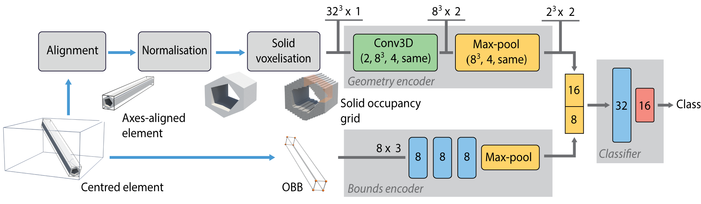
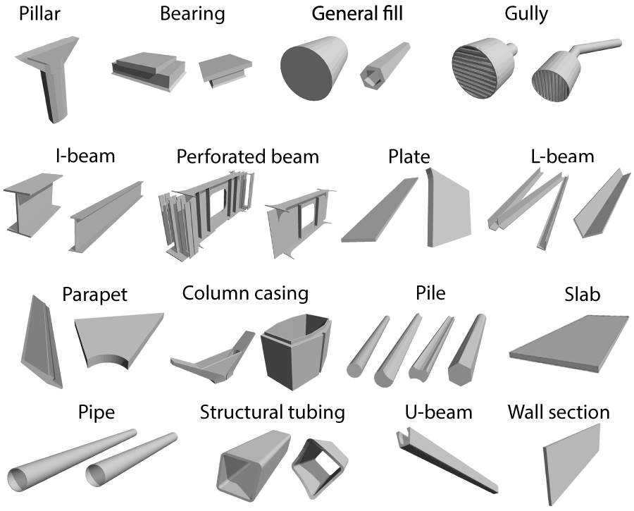

# Shape Classification of Building Information Models using Neural Networks

## Overview

This repository contains the source code of the short paper presented in 3DOR workshop 2021. Please find below links to

* [Author version of the paper](http://graphics.cs.aueb.gr/graphics/docs/papers/BIM3DOR.pdf)
* Video presentation

## Repository contents

The project is composed of the following parts :

* [An implementation of the solid voxelization algorithm](#solid_voxelization)
* [The neural network architecture](#neural_network_architecture)
* [A dataset folder with a template for each type of BIM class](#dataset)

## Solid Voxelization
A single file implementation of the solid voxelization algorithm. The main source code can be found in :

* `voxelizer\src\voxelizer.cpp`

Building and running the code will require :

* `Visual Studio 2017` or `2019`

## Neural Network Architecture

A tensorflow 2.4 implementation of the proposed neural architecture can be found in :
* `python\src\model.py`

An example entry point for training and testing our model can be found in :
* `python\train.py`
* `python\test.py`

The augmentation, normalization and alignment function implementations are located in :
* `python\src\utils.py`
* `python\src\dataset_builder.py`

An example entry point for creating the dataset is located in :
* `python\preprocessor.py`

## Dataset

In `python\dataset\BIM templates` directory, one can find the 3D model templates for each one of the 16 classes used for evaluation in the paper.

> __Shape Classification of Building Information Models using Neural Networks__  
> I. Evangelou, N. Vitsas, G. Papaioannou, M. Georgioudakis, A. Chatzisymeon 
> _to appear: Eurographics Workshop on 3D Object Retrieval (3DOR) 2021 short papers_
> [ [Paper](http://graphics.cs.aueb.gr/graphics/docs/papers/BIM3DOR.pdf) ]
